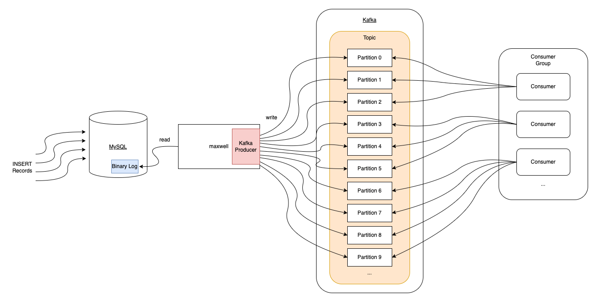

# maxwell-mysql-kafka-example

MySQL to Kafka Change Data Capture Demo with https://maxwells-daemon.io/



## Docker

### Start & Stop

```bash
docker-compose up -d
docker-compose logs -f
docker-compose down
```

## Maxwell's Daemon

### producer=stdout

```bash
docker run -it --rm --network maxwell-mysql-kafka-example_default zendesk/maxwell bin/maxwell --user=root --password=root --host=mariadb --producer=stdout
```

Use Adminer (http://localhost:8081) to add mysql records to app database.

### producer=kafka

```bash
docker run -it --rm --network maxwell-mysql-kafka-example_default zendesk/maxwell bin/maxwell --user=root --password=root --host=mariadb --producer=kafka --kafka.bootstrap.servers=kafka:9092 --kafka_topic=jobs --producer_partition_by=primary_key
```

Use Kafdrop (http://localhost:9000) to read kafka topics.

```bash
# exec shell in kafka container
docker-compose exec -it kafka /bin/bash
# create topic with 20 partitions
kafka-topics.sh --bootstrap-server localhost:9092 --create --topic jobs --partitions 20 --replication-factor 1
# delete topic
kafka-topics.sh --bootstrap-server localhost:9092 --delete --topic jobs
```

Create topic with 20 partitions. (Maxwell will create topic with only 1 partition)

## Go Producer for MySQL

Add 100 records to mysql to check kafka partition rotation.

```bash
go run producer/producer.go
```

